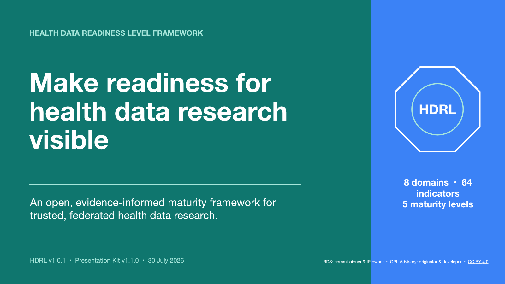

# HDRL Presentation Kit

An editable, modular slide deck for people who want to introduce HDRL to colleagues, host a team discussion or invite independent testing.

[Download the PowerPoint :material-microsoft-powerpoint:](downloads/HDRL-Presentation-Kit-v1.1.0.pptx){ .md-button .md-button--primary download="HDRL-Presentation-Kit-v1.1.0.pptx" }
[Read the medRxiv preprint :material-open-in-new:](https://www.medrxiv.org/content/10.64898/2026.07.23.26358713v1){ .md-button target="_blank" rel="noopener" }

!!! info "Version and source"
    **Presentation Kit v1.1.0 — 30 July 2026** presents **HDRL Framework v1.0.1** using indicator catalogue **v1.0.2**. The 64 indicator slides are generated from the machine-readable catalogue and reproduce its maturity descriptors and Level 4 minimum-evidence requirements verbatim.

## What is included

The 16:9 PowerPoint contains **92 editable slides**, including:

- a presenter guide with suggested 5-minute, 10-minute, 20-minute and workshop routes;
- a simple explanation of the problem HDRL addresses;
- the eight domains, 64-indicator architecture and five maturity levels;
- eight modular domain contents slides listing every indicator;
- a separate detail slide for each of the 64 indicators, showing all five maturity descriptors and the indicator-specific minimum evidence for Level 4;
- practical guidance on evidence, assessment scope and use of results;
- development method, formative application and validation limitations;
- a current comparison of the questions addressed by HDRL and SATRE 2.0;
- discussion prompts, responsible-reuse guidance and a call for critique and independent testing; and
- speaker notes with a suggested talk track, selection guidance and source links.

The first slide is for presenters and can be removed before sharing a selected route. The complete file is a slide library: presenters are expected to select the relevant domain and indicator slides rather than deliver all 92 slides.

Slides 21–92 are designed primarily as **reference, handout or close-discussion slides**. Their detail works best on a laptop, in a small facilitated group or when circulated after a session. For a room presentation, select only one or two indicators that are directly relevant to the discussion.

## Accessibility and presentation use

The downloadable file includes recognised slide-title placeholders, a defined object order, decorative-object exclusions, active descriptive links and speaker notes. Before presenting an adapted version, run PowerPoint's Accessibility Checker—especially if you have moved slides into another template or changed the object order.

The website and CC BY 4.0 licence are linked from the footer of every standard slide. The closing slide also links directly to the paper, framework and structured feedback form.

## Use the slides your way

Download the PowerPoint, select the slides that suit your audience and adapt the wording or move the content into your organisation's own template. Please keep the framework's evidence and validation boundaries clear:

- HDRL is an evidence-informed maturity and improvement framework;
- it has been formatively applied across three UK health-data research systems;
- reliability, validity and fitness for accreditation have not yet been established;
- it is not an official HDRS standard, accreditation scheme or participation decision; and
- the primary invitation is to **read, critique, test and help validate** the framework.

## Credit and licence

The public framework materials, including this presentation kit, are available under [CC BY 4.0](https://creativecommons.org/licenses/by/4.0/).

If you reuse or adapt the slides:

1. retain **Research Data Scotland — commissioner and intellectual property rights owner**;
2. retain **OPL Advisory Ltd — originator and developer**;
3. link to the CC BY 4.0 licence; and
4. indicate if you made changes.

The licence does not imply endorsement of an adaptation, assessment or score by Research Data Scotland, OPL Advisory Ltd, the assessed nations or the UK Health Data Research Service. See [About, citation and reuse](about.md) for full guidance.

## Help improve the framework

If your team presents or applies HDRL, the most useful next step is to share where it fits, where it fails to fit and which indicators or descriptors are difficult to interpret or evidence consistently.

[Share structured feedback](https://docs.google.com/forms/d/e/1FAIpQLSdrcE7zwWvJ0Pu1klaKF1oAJA7lSyyMFnZp7BIJ6zSGJyk_NA/viewform){ .md-button .md-button--primary target="_blank" rel="noopener" }
